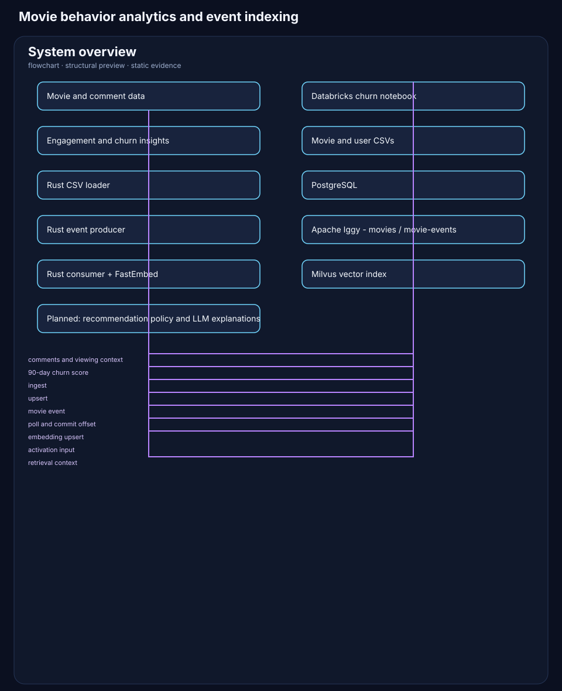

# Movies in Rust in Databricks

An event-driven movie data project that connects behavioral analytics in Databricks with a Rust streaming and semantic-indexing service.

The project answers two operational questions:

1. **Who is engaged, and what do they prefer?** The Top 10 view identifies active users and their dominant genres.
2. **Who is at risk of churning?** The churn model ranks inactive users using their probability of churn, inactivity window, latest commented movie, and associated genres.

The Rust service is the action layer: it publishes movie events to Apache Iggy, consumes them, creates FastEmbed vectors, and upserts them into Milvus for semantic retrieval.

> The Databricks analytics notebook and Rust event pipeline are implemented. Automated recommendation delivery and an LLM orchestration layer are planned next steps, not claimed as implemented functionality.

## Architecture



The editable diagram source is available in [architecture/system-overview.md](architecture/system-overview.md).

## Analytics outputs

### Top users and genre affinity

This view combines participation volume with dominant genre to give a concrete input for personalized campaigns and recommendation strategies.


### Churn risk ranking

This view turns comment inactivity into an actionable prioritization table. It contains the user-level score/probability, days without activity, latest commented movie, and genre context.


## What is implemented

| Area | Implementation |
| --- | --- |
| Behavioral churn analytics | Databricks notebook that models 90-day churn from comment inactivity and engagement features. |
| Movie and user loading | Rust CSV loader that upserts movie and user records into PostgreSQL. |
| Event transport | Rust producer creates the `movies` stream and `movie-events` topic in Apache Iggy, then publishes movie events. |
| Semantic indexing | Rust consumer polls Iggy, creates multilingual E5 embeddings with FastEmbed, and upserts documents into Milvus. |
| Idempotent event handling | Milvus uses `event_id` as its primary key; the consumer commits the Iggy offset after a successful upsert. |

## Repository layout

```text
.
├── architecture/                 # Editable Mermaid architecture diagram and preview
├── dashboard/                    # Engagement and churn visual outputs
├── databricks/                   # Churn forecasting notebook
├── mongodbatlas-samples/         # MongoDB sample_mflix movies, users, and comments CSVs
├── rust-service/                 # Rust event, ingestion, embedding, and vector-indexing binaries
└── docs/                         # Scope and next-step notes
```

## Rust service

The service is a Rust workspace with these binaries:

| Command | Purpose |
| --- | --- |
| `cargo run --bin load_csv` | Loads sample movie and user CSV data into PostgreSQL. |
| `cargo run --bin producer` | Creates Iggy stream/topic when needed and publishes a movie event. |
| `cargo run --bin consumer` | Consumes movie events, embeds title/genre, indexes into Milvus, and commits offsets. |
| `cargo run --bin setup_movie_events` | Creates the Milvus collection used by the consumer. |
| `cargo run --bin reset_movie_events` | Drops and recreates that movie-event collection. |
| `cargo run --bin fastembed_probe` | Verifies FastEmbed initialization locally. |
| `cargo run --bin milvus_probe` | Verifies Milvus connectivity and schema operations. |

Run commands from [`rust-service/`](rust-service/). The CSV loader resolves movies and users from `../mongodbatlas-samples/` relative to the Rust crate. The current code expects local Iggy, Milvus, and PostgreSQL; their endpoints are currently defined in the source files.

## Roadmap

- Feed the churn-ranked and genre-affinity signals into a recommendation policy.
- Add an LLM layer that explains recommendations using retrieved Milvus context.
- Externalize local endpoints, credentials, and CSV paths into configuration.
- Add automated integration tests covering Iggy to Milvus delivery and offset commits.

## Stack

Databricks · Python/Pandas · Rust · Apache Iggy · PostgreSQL · FastEmbed · Milvus
